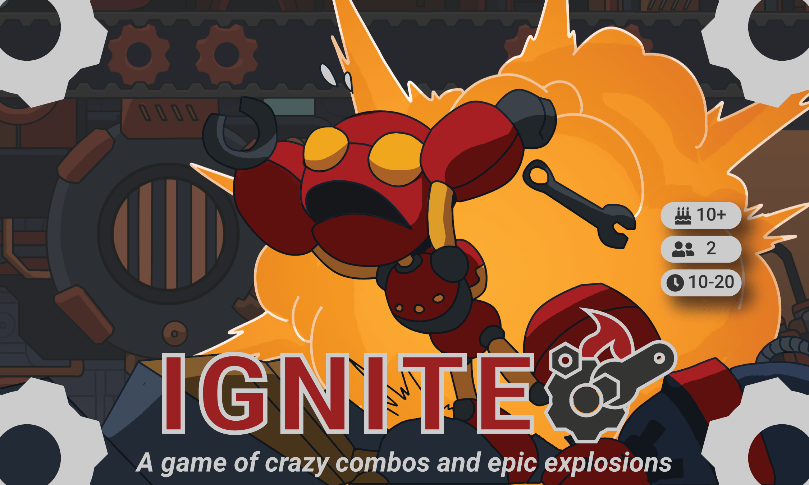

  
  
# [Ignite.cards](http://ignite.cards) - Ignite Official Website

### Sign up to be emailed when the Kickstarter starts on our website!

---

### About

**Ignite is a quick and simple board game where players race to destroy each other's forges by timing the ignition of their bots within a battlefield of crazy combos and epic explosions.**

- **10-20 min — 15 min to learn**

- **2+ players — Ages 10+**

- **Kickstarter 2019**

---

### Quick Links

- [Roll Dice](https://ignite.cards/roller/)

- [Card Gallery](https://ignite.cards/cards/)

---

### Socials:

- [Facebook](https://www.facebook.com/ignitecard/)

- [Twitter](https://twitter.com/ignitecards)

- [YouTube](https://www.youtube.com/channel/UC-yp5arUJMH2GeDmY12h6ZA)

- [Email](contact@ignite.cards)

### Credit:

- Website by Justin Golden and Vincent Nagoshi

